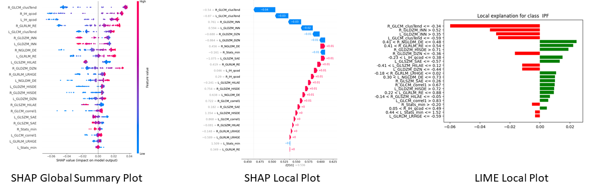
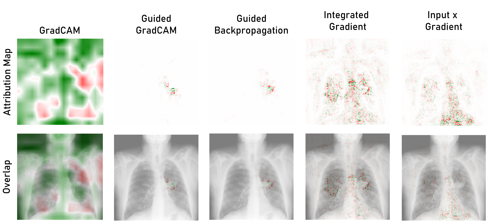
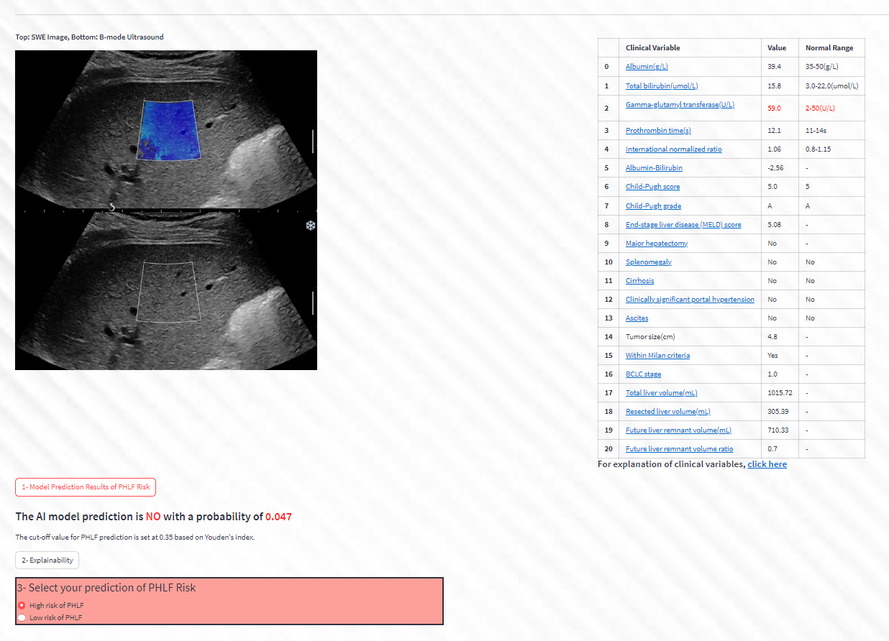
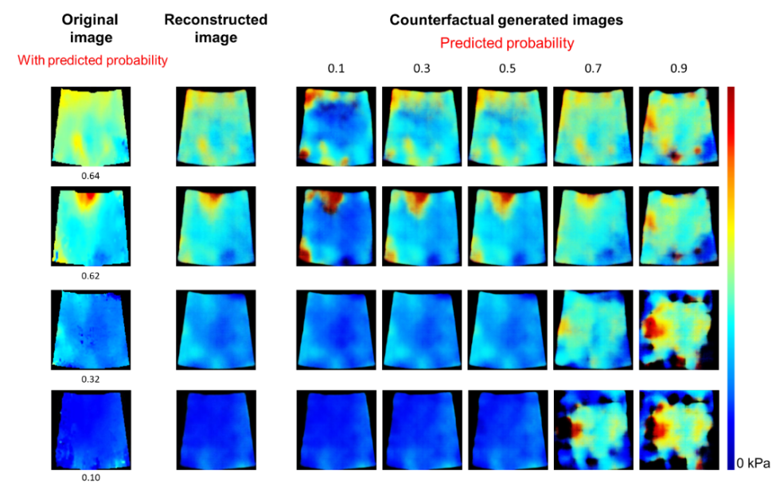
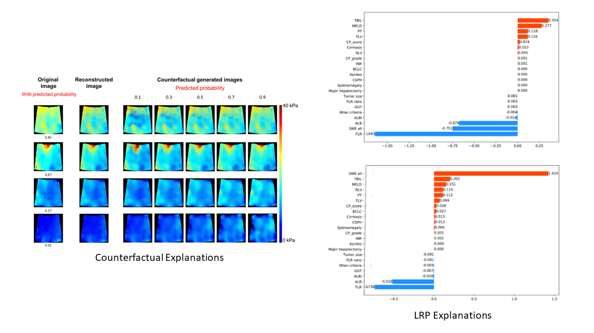

# Radiomics Explainability Toolbox

## Introduction

The Radiomics Explainability Toolbox is a comprehensive utility for enhancing the explainability of both handcrafted radiomics models and deep learning models. This toolbox includes five distinct tools, each with its own folder and README file:

1. **Handcrafted Radiomics Explanations Tool:** This tool provides explanations for handcrafted radiomics models using techniques like LIME, SHAP, and DICE. It aids in understanding and interpreting radiomics model predictions.

   

2. **Attribution Maps for PyTorch-Based 2D and 3D Deep Learning Classifiers:** This tool is designed for generating heatmaps to visualize the decision-making process of PyTorch-based deep learning models in medical image analysis. It supports 2D and 3D images and is useful for understanding model focus areas.

   

3. **In Silico Trial - Streamlit Application:** This Streamlit application facilitates in silico trials. It guides users through usability testing, clinical trials with AI models, and AI models with explanations. The application includes a landing page, initialization, usability test, AI trial, AI + explanation trial, final pages, and an end questionnaire.

   

4. **Post-Hepatectomy Liver Failure Prediction with Counterfactual Explanations:** This tool focuses on predicting post-hepatectomy liver failure using Shear Wave Elastography (SWE) images. It employs a Variational Autoencoder (VAE) and a Multi-Layer Perceptron (MLP) classifier, along with counterfactual explanations, to enhance model interpretability.

   

5. **Post-Hepatectomy Liver Failure Prediction with Counterfactual Explanations and Layerwise Relevance Propagation (LRP):** This tool extends the previous tool by adding Layerwise Relevance Propagation (LRP) explanations. It enables the interpretation of the model's predictions through LRP local and global plots in addition to counterfactual explanations.

   

## Getting Started

Before using any of the tools in this toolbox, ensure you have the necessary prerequisites in place and follow the instructions provided in the respective README files for each tool.

## Customization

Each tool in this toolbox offers customization options, typically through configuration files. You can tailor the behavior of these tools to your specific use case by modifying the configuration parameters as outlined in the individual README files.

## Results and Interpretation

These tools are designed to enhance the interpretability of your radiomics and deep learning models. They provide explanations, heatmaps, and insights into model predictions, enabling you to make more informed decisions in the field of medical image analysis.

Please refer to the README files in the respective folders for each tool for detailed instructions on usage, customization, and interpretation.

**Note:** Ensure that you have proper permissions to access and use the data, models, and resources required by each tool.
